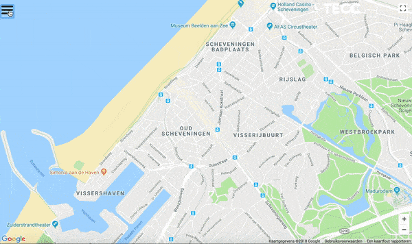

# Workshop "OpenFlight" by TECC-SE
> Workshop for reactive streams using [OpenFlight data](https://openflights.org/data.html) in a reactive backend to plot markers or show a list and update their data accordingly.



## A - Development server with mock backend (nodeJS)
1) `npm run dev:mock`. Navigate to `http://localhost:4200/`. The app will automatically reload if you change any of the source files. If you want to run on another port `npm run dev:mock -- port=4444`
2) `npm start`

## B - Development server with real backend (Java)
1) Run your backend server and fill in your endpoint in './proxy-backend.conf.json'
2) `npm run dev:backend`. Navigate to `http://localhost:4200/`

# WORKSHOP
When you finished your backend you can now start with the frontend (or if you don't want to make your own backend you can run the frontend mock one). You can choose between creating a 'map application' and a 'list application'.
In the development branch we created an Angular/Rxjs scaffold where we put the service which you can use to start with.

## Service

```
get(origin: string): Observable<OpenFlight> {

  const url = `${environment.api}/offers/${origin}`;

  return Observable.create((observer) => {

    const eventSource = new window['EventSource'](url);

    eventSource.onmessage = ((event) => this.ngZone.run(() => {
      const json = JSON.parse(event.data);
      return observer.next(json);
    }));

    eventSource.onerror = ((error) => this.ngZone.run(() => {
      if (eventSource.readyState === 0) {
        eventSource.close();
        return observer.complete();
      } else {
        return observer.error('EventSource error: ' + error);
      }
    }));

    return () => eventSource.close();
  });

}
```

### List view
Try to alter the service so it will give back the complete list as a result. When you have a listview try adding a sparkline for historical prices ([ChartJS](http://www.chartjs.org/samples/latest/charts/line/basic.html) is added by default). [example](./internals/docs/LIST.md)

### Map view
When you are more familiair with [Google Maps API](https://developers.google.com/maps/documentation/javascript/overlays) it will be possible to plot the markers on the Map and update them accordingly. For this you will need to know the limitations of their API (no destroy, no repaint on marker update).

## Build
- Testing build: `npm run dev -- --port=4444 --configuration=production --prod`
- Running build `npm run build:prod`. The build artifacts will be stored in the `dist/` directory.

## Further help
Simply ask the people walking near you :)

*workshop is provided by [TECC-SE](https://confluence.devnet.klm.com/display/TECCSE/TECC+Software+Engineering+Home) innovations at [AFKLM](https://github.com/afklm)*
